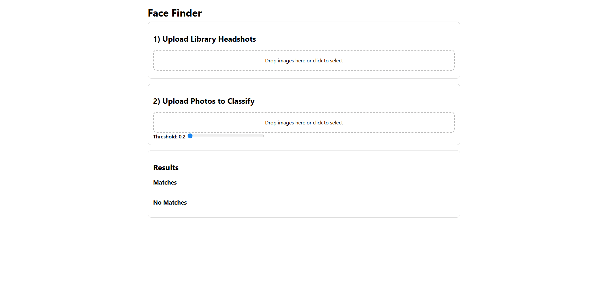

# FaceDetect

A small full-stack web app that indexes a library of headshots and sorts uploaded
photos by whether they contain a **known face**. Face embeddings are generated with
[InsightFace](https://github.com/deepinsight/insightface) and compared using cosine
similarity, with an adjustable match threshold.

## Demo



## Motivation

The idea came from my internship at State Farm, where every photo needed a signed
consent form — a real bottleneck at scale. Tools like Apple and Google Photos group
faces but don't help you control *who is allowed* to appear in a set of images.
FaceDetect is a first step toward **consent- and privacy-aware photo management**:
identify known people in a batch of photos so the "who's in this?" question can be
answered automatically.

## Features

- Drag-and-drop upload for both **library headshots** and **photos to classify**.
- Face embeddings extracted automatically with InsightFace (running on CPU).
- Photos are split into **matches** / **no matches** against the indexed library.
- Adjustable **similarity threshold** via a slider for tuning strictness.
- Zero-config storage on the local file system.

## Tech Stack

- **Backend:** FastAPI, InsightFace, OpenCV, NumPy, Uvicorn
- **Frontend:** HTML, CSS, vanilla JavaScript (no build step)
- **Storage:** Local file system

## Project Structure

```
FaceDetect/
├── backend/
│   ├── app.py            # FastAPI server: indexing + classification endpoints
│   └── requirements.txt  # Python dependencies
├── frontend/
│   └── index.html        # Single-page UI (served by the backend)
├── LICENSE
└── README.md
```

At runtime the backend also creates `backend/library_headshots/` and
`backend/uploaded_photos/` to store images; these are git-ignored.

## Getting Started

### Prerequisites

- Python 3.9+
- pip

### Installation

```bash
cd backend
python -m venv .venv

# Windows
.venv\Scripts\activate
# macOS / Linux
source .venv/bin/activate

pip install -r requirements.txt
```

> On first run, InsightFace downloads its pretrained model (a few hundred MB),
> so the initial startup can take a little while.

### Run

```bash
# from the backend/ directory, with the virtualenv active
uvicorn app:app --reload
```

Then open <http://127.0.0.1:8000> in your browser.

## Usage

1. **Upload library headshots** — drop in the reference photos of the people you
   want to recognize. Each headshot should contain a single, clear face.
2. **Upload photos to classify** — drop in the photos you want to sort.
3. **Adjust the threshold** — higher values require a closer match. `0.38` is a
   reasonable starting point.
4. Results appear as thumbnails under **Matches** and **No Matches**.

## How It Works

1. Each image is passed through InsightFace, which detects faces and produces a
   512-dimensional embedding per face.
2. Library embeddings are cached in memory, keyed by filename.
3. For each photo to classify, every detected face is compared against every
   library embedding using **cosine similarity**. If any pair scores at or above
   the threshold, the photo is labeled a match.

## API

| Method | Endpoint               | Description                                  |
| ------ | ---------------------- | -------------------------------------------- |
| `GET`  | `/`                    | Serves the frontend                          |
| `POST` | `/api/index`           | Adds uploaded headshots to the library index |
| `POST` | `/api/classify_photos` | Classifies uploaded photos against the index |

## Roadmap

This prototype validates the core idea (face-embedding search). The direction I find
most interesting is turning it into a consent-aware tool:

- Per-person profiles and tagging of who is *allowed* in a photo.
- A "do not photograph" option for people who opt out of being photographed.
- Automatic blurring or minor-detection to help with legal compliance.

## Limitations

Being a prototype, it cuts some corners worth calling out:

- The embedding index lives in memory, so it resets on restart (a persistent store
  like SQLite + a FAISS vector index would fix this and scale search past the current
  linear scan).
- Only the first detected face per library headshot is indexed.
- No authentication, rate limiting, or input validation.

## License

Released under the [MIT License](LICENSE).
